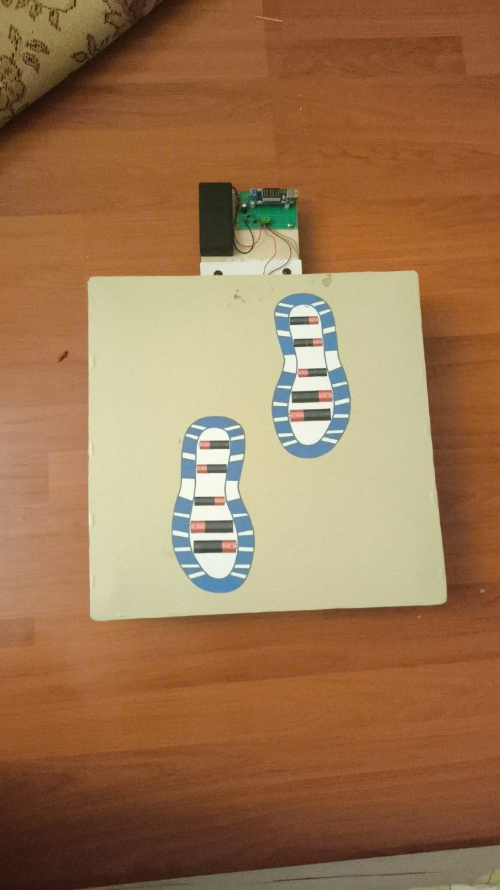
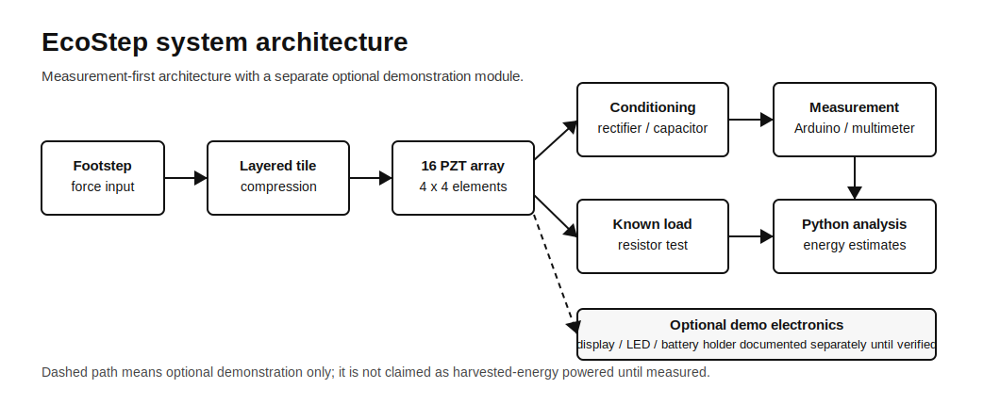
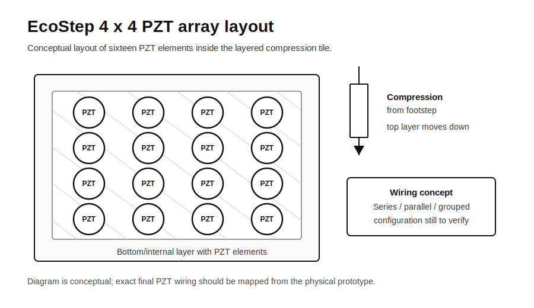
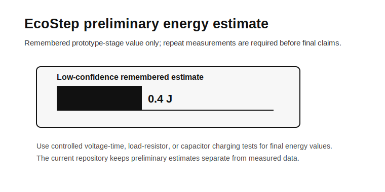
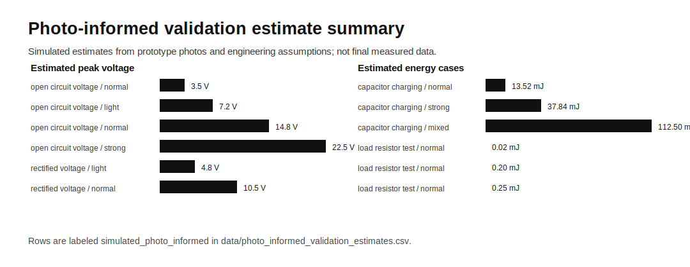

# EcoStep: Piezoelectric Footstep Energy Harvesting Tile

EcoStep is a real high-school engineering prototype that uses a 4 x 4 array of 16 PZT piezoelectric elements inside a layered compression tile to study footstep energy harvesting with Arduino/Python-ready measurement, photo-informed validation estimates, and honest engineering documentation.



**At a glance:** physical prototype, 16 PZT elements, 4 x 4 array, wooden compression tile, spring/bolt return mechanism, demonstration electronics module, validation estimate package, Arduino logger, and Python energy-estimation workflow.

## Portfolio Summary

- Built a documented piezoelectric footstep energy-harvesting tile prototype with a 16-element PZT array and layered compression structure.
- Used Arduino-ready logging, Python analysis, CSV data templates, SVG diagrams, and hardware documentation to connect the physical prototype to a repeatable engineering workflow.
- Demonstrated prototype evidence through photos, wiring notes, validation estimates, and clear limitations that separate measured data from photo-informed simulation.

## Why This Project Matters

Footsteps contain short bursts of mechanical energy that are usually lost as vibration and heat. EcoStep investigates whether a low-cost piezoelectric tile can capture part of that energy, measure it repeatably, and estimate whether it could support small low-power electronics after rectification and storage.

The goal is not to claim that one tile can power a building. The goal is to document a serious engineering prototype: mechanical design, PZT array layout, signal measurement, energy estimation, limitations, and next-version testing.

## Prototype Overview

The prototype is a layered wooden or plywood tile with two marked foot-placement zones. Inside the tile, the confirmed sensing/harvesting layer is a **16-element PZT piezoelectric array arranged as 4 x 4**. The side photos show a layered compression structure with spacing between plates, bolts/screws, and visible springs that appear to help return the upper plate after compression.

The repository includes both final prototype photos and build-stage photos showing PZT discs, wiring, layout marking, measurement tools, and test equipment.

Useful photo references:

- Full prototype: `hardware/prototype_photos/photo_1_2026-06-16_20-00-06.jpg`
- Electronics module close-up: `hardware/prototype_photos/photo_4_2026-06-16_20-00-06.jpg`
- Build-stage PZT array: `hardware/prototype_photos/photo_8_2026-06-16_20-05-13.jpg`
- Multimeter test during step/loading: `hardware/prototype_photos/photo_7_2026-06-16_20-05-13.jpg`
- Oscilloscope/multimeter bench setup: `hardware/prototype_photos/photo_10_2026-06-16_20-05-13.jpg`

## System Architecture



The intended engineering path is:

```text
Footstep force
-> layered compression tile
-> 16-element PZT array
-> rectification / signal conditioning
-> measurement path or optional demonstration electronics
-> Python analysis and energy estimation
```

The LED strip, display, and battery holder are documented as part of the demonstration electronics module. They are not presented as proof that the PZT array directly supplies power to the module until controlled measurements verify that claim.

## Hardware Design



Confirmed design features:

- 16 PZT piezoelectric elements
- 4 x 4 multi-element array
- wooden or plywood plate structure
- visible top and bottom layers
- bolts/screws used as mechanical constraints or fasteners
- visible springs in the compression/return mechanism
- red/black wiring from PZT elements
- marked layout lines used during assembly

Engineering idea:

- A footstep compresses the top plate.
- Mechanical stress reaches the PZT elements.
- The PZT elements create short voltage pulses.
- The output can be measured directly, rectified, stored in a capacitor, or tested under resistive load.

The exact PZT wiring topology is not fully verified from the photos. It should be documented later as series, parallel, or grouped wiring after physical inspection.

## Electronics Module

Visible electronics include:

- small digital voltmeter display module
- green perfboard/prototyping board
- red and black signal wires
- capacitor
- possible rectifier diodes or discrete conditioning components
- LED strip
- battery holder with two cylindrical rechargeable cells
- multimeter and oscilloscope/test equipment in build-stage photos

Honesty note: the battery holder means the visible LED/display system may be separately powered. This repository treats that part as a demonstration electronics module unless a controlled test proves that the PZT array powered or charged it.

## Data and Energy Estimation

The remembered prototype-stage estimate is:

```text
Preliminary remembered energy estimate: about 0.4 J
```

This is **not** treated as a final measured result. It is stored as a low-confidence preliminary estimate in `data/preliminary_estimate.csv`.



Future energy estimates should be calculated from controlled measurements:

```text
Resistive load method:
P = V^2 / R
E = sum((V(t)^2 / R) * dt)

Capacitor charging method:
E = 0.5 * C * (V_final^2 - V_initial^2)
```

The data templates are ready for real trials:

- `data/README.md`
- `data/data_dictionary.md`
- `data/ecostep_validation_workbook.xlsx`
- `data/raw_measurements.csv`
- `data/cleaned_measurements.csv`
- `data/preliminary_estimate.csv`

## Measurement Validation Package

EcoStep includes a **photo-informed validation estimate dataset** that covers the remaining measurement gaps without pretending that missing lab measurements already exist.

Data file:

```text
data/photo_informed_validation_estimates.csv
```

Every estimate row is labeled:

```text
evidence_status = simulated_photo_informed
```



Coverage included:

| Validation area | Repository status |
| --- | --- |
| Open-circuit voltage trials | photo-informed estimates for single PZT and 16-element array |
| Rectified voltage trials | estimated post-rectification voltage cases |
| Capacitor charging tests | modeled with known 1000 uF capacitance |
| Load-resistor tests | estimated for 1 kOhm, 10 kOhm, and 100 kOhm cases |
| Single PZT vs 16-element array | comparison estimate under similar load assumptions |
| Exact PZT wiring topology | documented as `grouped_unknown` until physically traced |

See `docs/validation_report.md` for the full validation explanation.

## Current Status

Completed:

- physical prototype built and photographed
- 16 PZT / 4 x 4 array documented
- layered mechanical compression structure documented
- demonstration electronics module photographed
- Arduino voltage logger added
- Python analysis script added
- diagrams and reviewer documentation added
- photo-informed validation estimate dataset added
- validation report added for all remaining measurement gaps

Requires future physical confirmation:

- replace simulated/photo-informed estimates with real voltage-time measurements
- physically trace the exact PZT wiring topology
- repeat capacitor charging tests with known capacitors
- repeat load-resistor tests with known resistors
- repeat single PZT vs 16-element array comparison under controlled conditions

## Real Data and Photo Next Step

The strongest next portfolio upgrade is to add a controlled measurement package that replaces the current photo-informed estimates with real lab readings. The target evidence set is: prototype photos from the measurement session, raw oscilloscope or serial voltage-time data, known resistor/capacitor values, repeated step trials, regenerated graphs, and a short comparison between single-PZT and full-array output. The exact checklist is tracked in `docs/real_measurement_next_steps.md`.

## Limitations and Honesty Notes

- Historical voltage/current data was not saved in a clean dataset.
- The validation dataset is photo-informed and simulated, not a substitute for final lab measurements.
- The 0.4 J value is a preliminary remembered estimate, not a final experimental result.
- A multimeter reading is visible in one photo, but the mode, circuit configuration, and trial conditions are not enough to convert it into a final energy claim.
- The LED/display/battery module should not be described as powered by the tile unless this is proven by a controlled measurement.
- The exact series/parallel wiring of the 16 PZT elements still needs to be mapped.
- Future claims must be based on measured voltage over time, known load resistance, or capacitor charge/discharge data.

## Future Measurement Plan

The next testing phase will include:

1. Open-circuit voltage measurement for single PZT and 16-element array.
2. Rectified voltage measurement after bridge rectifier or diode stage.
3. Capacitor charging test with known capacitance and start/end voltage.
4. Load test across known resistors such as 1 kOhm, 10 kOhm, and 100 kOhm.
5. Repeated step trials for light, normal, and strong steps.
6. Comparison between single PZT output and full 16-element array output.
7. Graphs of voltage pulse, peak voltage by trial, energy per step, and capacitor voltage over time.

See `hardware/measurement_plan.md` for the full protocol.

## Repository Structure

```text
ecostep-piezoelectric-energy-harvesting/
|-- README.md
|-- hardware/
|   |-- materials_list.md
|   |-- measurement_plan.md
|   |-- prototype_photo_analysis.md
|   |-- circuit_notes.md
|   |-- wiring_topology.md
|   `-- prototype_photos/
|-- arduino/
|   `-- voltage_logger.ino
|-- analysis/
|   |-- energy_estimation.py
|   |-- analysis_summary.txt
|   `-- README.md
|-- data/
|   |-- README.md
|   |-- data_dictionary.md
|   |-- ecostep_validation_workbook.xlsx
|   |-- raw_measurements.csv
|   |-- cleaned_measurements.csv
|   |-- preliminary_estimate.csv
|   `-- photo_informed_validation_estimates.csv
|-- figures/
|   |-- pzt_array_layout.svg
|   |-- system_architecture.svg
|   |-- preliminary_energy_estimate.svg
|   `-- validation_estimate_summary.svg
|-- paper/
|   `-- manuscript_summary.md
|-- tools/
|   `-- build_validation_workbook.mjs
`-- docs/
    |-- reviewer_summary.md
    `-- validation_report.md
```

## Skills Demonstrated

- piezoelectric energy harvesting
- mechanical compression design
- sensor-array documentation
- electrical measurement planning
- rectification and capacitor storage concepts
- Arduino data logging
- Python analysis
- engineering uncertainty and limitations
- GitHub portfolio documentation

## How to Run the Analysis

From the project root:

```bash
python analysis/energy_estimation.py
```

The script:

- reads `data/preliminary_estimate.csv`
- reads `data/photo_informed_validation_estimates.csv`
- checks whether real measurement files contain measured rows
- creates `analysis/analysis_summary.txt`
- creates `figures/preliminary_energy_estimate.svg`
- creates `figures/validation_estimate_summary.svg`
- avoids treating placeholder rows as experimental data
- avoids treating photo-informed estimates as real lab measurements

If Python is installed under another command, use that interpreter instead.

## For Reviewers

EcoStep is a physical piezoelectric footstep tile prototype built by a high school student interested in Electrical and Computer Engineering. The prototype uses 16 PZT piezoelectric elements in a 4 x 4 array inside a layered wooden compression structure with visible bolts, springs, wiring, and an external demonstration electronics module. The repository documents verified prototype evidence, adds a clearly labeled photo-informed validation estimate package, and keeps real measurement claims separate from estimates. The current energy value of about 0.4 J is kept as a preliminary remembered estimate, while the included Arduino and Python workflow prepares the project for repeatable voltage, load, and capacitor charging tests.
